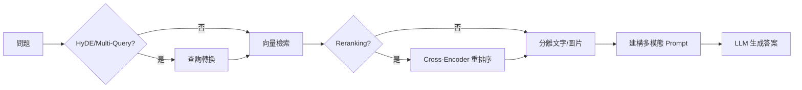

# Multimodal RAG System - 專案完整文件

> 供下一個 AI Agent 參考的專案詳細資訊

---

## 📌 專案概述

| 項目     | 說明                           |
| -------- | ------------------------------ |
| **名稱** | Multimodal RAG System          |
| **目的** | PDF 文件 OCR、翻譯、知識庫問答 |
| **框架** | FastAPI + LangChain            |
| **部署** | 本地 GPU 伺服器                |

---

## 🛠️ 技術棧

| 類別           | 技術                                                 |
| -------------- | ---------------------------------------------------- |
| **後端框架**   | FastAPI + Uvicorn                                    |
| **OCR 引擎**   | Local Marker (Local) / Datalab API (Cloud)           |
| **LLM**        | Google Gemini API (gemini-3.0-flash, gemma-3-27b-it) |
| **向量嵌入**   | Google Gemini Embedding 001                          |
| **向量資料庫** | FAISS                                                |
| **重排序**     | cross-encoder/ms-marco-MiniLM-L-12-v2                |
| **資料庫**     | Supabase (PostgreSQL + Auth)                         |
| **PDF 生成**   | markdown-pdf                                         |

---

## 📁 目錄結構

```
d:\flutterserver\pdftopng\
├── main.py                     # FastAPI 應用入口
├── config.env                  # 環境變數配置
├── requirements.txt            # Python 依賴
│
├── core/                       # 核心模組
│   ├── auth.py                 # Supabase JWT 認證
│   ├── llm_factory.py          # LLM 工廠 (雙模型配置)
│   └── supabase_client.py      # Supabase 客戶端
│
├── pdfserviceMD/               # PDF OCR + 翻譯服務
│   ├── router.py               # API 路由 (/pdfmd/*)
│   ├── PDF_OCR_services.py     # Hybrid OCR (Marker/Datalab)
│   ├── local_marker_service.py # Local Marker 實作
│   ├── ai_translate_md.py      # 翻譯入口
│   ├── translation_chunker.py  # 頁面分塊翻譯
│   ├── markdown_to_pdf.py      # Markdown → PDF
│   └── markdown_process.py     # 圖片佔位符處理
│
├── data_base/                  # RAG 核心服務
│   ├── router.py               # API 路由 (/rag/*)
│   ├── RAG_QA_service.py       # 問答服務
│   ├── vector_store_manager.py # FAISS 向量庫
│   ├── word_chunk_strategy.py  # 分塊策略
│   ├── semantic_chunker.py     # 語義分塊
│   ├── reranker.py             # Cross-Encoder 重排序
│   ├── query_transformer.py    # HyDE/Multi-Query
│   ├── context_enricher.py     # 上下文增強
│   ├── proposition_chunker.py  # 命題分塊
│   └── parent_child_store.py   # 父子文件存儲
│
├── agents/                     # AI Agent 模組
│   ├── evaluator.py            # Self-RAG 評估器
│   ├── planner.py              # 任務規劃器
│   └── synthesizer.py          # 結果合成器
│
├── multimodal_rag/             # 多模態處理
│   ├── structure_analyzer.py   # 文檔結構分析
│   ├── image_summarizer.py     # 圖片摘要生成
│   └── schemas.py              # 資料模型
│
├── graph_rag/                  # 🆕 GraphRAG 知識圖譜
│   ├── schemas.py              # Node, Edge, Community 定義
│   ├── store.py                # NetworkX 圖譜存儲
│   ├── extractor.py            # LLM 實體/關係抽取
│   ├── entity_resolver.py      # 實體融合
│   ├── community_builder.py    # Leiden 社群檢測
│   ├── local_search.py         # 實體擴展搜尋
│   ├── global_search.py        # 社群 Map-Reduce
│   └── router.py               # /graph 端點
│
├── image_service/              # 獨立圖片翻譯
│   └── router.py               # API 路由 (/imagemd/*)
│
└── tests/                      # 測試套件
    ├── test_evaluator.py
    ├── test_planner.py
    └── ...
```

---

## 🔌 API 端點

### PDF OCR + 翻譯 (`/pdfmd`)

| 端點                    | 方法   | 說明                             |
| ----------------------- | ------ | -------------------------------- |
| `/pdfmd/upload_pdf_md`  | POST   | 上傳 PDF → OCR → 翻譯 → 返回 PDF |
| `/pdfmd/files`          | GET    | 列出用戶所有文件                 |
| `/pdfmd/files/{doc_id}` | DELETE | 刪除指定文件                     |

**POST /pdfmd/upload_pdf_md:**

```python
# Request: multipart/form-data
file: UploadFile  # PDF 檔案

# Response: application/pdf
# 返回翻譯後的 PDF 二進制檔案
```

---

### RAG 問答 (`/rag`)

| 端點            | 方法 | 說明                      |
| --------------- | ---- | ------------------------- |
| `/rag/ask`      | GET  | 基本問答                  |
| `/rag/research` | POST | 深度研究 (Plan-and-Solve) |

**GET /rag/ask:**

```python
# Query Parameters
question: str                    # 問題
doc_ids: Optional[List[str]]     # 限定文件 ID
enable_reranking: bool = True    # 啟用重排序
enable_hyde: bool = False        # 啟用 HyDE
enable_multi_query: bool = False # 啟用多查詢

# Response
{
    "question": str,
    "answer": str,
    "sources": List[str]  # 引用的文件 ID
}
```

**POST /rag/research:**

```python
# Request Body
{
    "question": str,
    "max_subtasks": int = 5
}

# Response
{
    "question": str,
    "summary": str,           # 摘要
    "detailed_answer": str,   # 詳細答案
    "sub_tasks": List[...],   # 子任務結果
    "all_sources": List[str],
    "confidence": float
}
```

---

### GraphRAG 知識圖譜 (`/graph`)

| 端點              | 方法 | 說明         |
| :---------------- | :--- | :----------- |
| `/graph/status`   | GET  | 取得圖譜狀態 |
| `/graph/rebuild`  | POST | 強制重建圖譜 |
| `/graph/optimize` | POST | 執行實體融合 |

---

## 🤖 LLM 配置

### 模型分配

| 用途            | 模型               | Input Limit | Output Limit |
| --------------- | ------------------ | ----------- | ------------ |
| **translation** | `gemini-3.0-flash` | 1,048,576   | 8,192        |
| **graph_***     | `gemini-3.0-flash` | 1,048,576   | 8,192        |
| **其他所有**    | `gemma-3-27b-it`   | 131,072     | 8,192        |

### LLM 用途類型

```python
LLMPurpose = Literal[
    "rag_qa",              # 問答 (gemma-3)
    "translation",         # 翻譯 (gemini-3-flash)
    "image_caption",       # 圖片描述
    "context_generation",  # 上下文生成
    "proposition_extraction",
    "query_rewrite",       # HyDE/Multi-Query
    "evaluator",           # Self-RAG 評估
    "planner",             # 任務規劃
    "synthesizer",         # 結果合成
    "summary",             # 摘要
    "graph_extraction",    # 🆕 GraphRAG 實體抽取 (gemini-3-flash)
    "community_summary"    # 🆕 社群摘要 (gemini-3-flash)
]
```

### 使用方式

```python
from core.llm_factory import get_llm

llm = get_llm("translation")  # → gemini-3.0-flash
llm = get_llm("rag_qa")       # → gemma-3-27b-it
```

---

## 📊 資料流

### PDF 處理流程

```mermaid
flowchart LR
    A[PDF 上傳] --> B{OCR Mode}
    B -->|Local| C[Marker Service]
    B -->|Cloud| D[Datalab API]
    C --> E["Markdown + [[PAGE_N]]"]
    D --> E
    E --> F[圖片佔位符提取]
    F --> G[頁面分塊翻譯]
    G --> H[圖片佔位符還原]
    H --> I[生成翻譯 PDF]
    F --> J[RAG 索引 (Background)]
```

### RAG 問答流程



---

## 🔐 認證機制

### Supabase JWT

```python
# core/auth.py
async def get_current_user_id(
    authorization: str = Header(...)
) -> str:
    # 1. 解析 Bearer token
    # 2. Supabase 驗證 JWT
    # 3. 返回 user_id
```

### 開發模式

```env
# config.env
DEV_MODE=true  # 跳過認證，使用測試用戶
```

---

## 🧪 測試

### 執行測試

```powershell
cd d:\flutterserver\pdftopng
pytest tests/ -v
```

### 測試覆蓋

| 模組     | 測試檔案                                                                                       |
| -------- | ---------------------------------------------------------------------------------------------- |
| Self-RAG | Backend sibling: `../pdftopng/tests/test_evaluator.py`                 |
| 任務規劃 | Backend sibling: `../pdftopng/tests/test_planner.py`                   |
| 結果合成 | Backend sibling: `../pdftopng/tests/test_synthesizer.py`               |
| 語義分塊 | Backend sibling: `../pdftopng/tests/test_semantic_chunker.py`         |
| 查詢轉換 | Backend sibling: `../pdftopng/tests/test_query_transformer.py`       |
| 重排序   | Backend sibling: `../pdftopng/tests/test_reranker.py`                 |

---

## 🚀 啟動專案

```powershell
cd d:\flutterserver\pdftopng

# 設定環境變數
# 確保 config.env 包含:
# - GOOGLE_API_KEY
# - HF_TOKEN
# - SUPABASE_URL
# - SUPABASE_KEY
# - USE_LOCAL_MARKER (true/false)
# - DATALAB_API_KEY (如果 USE_LOCAL_MARKER=false)

# 啟動
uvicorn main:app --reload --port 8000
```

---

## 📈 開發路線圖

| Phase | 功能                  | 狀態      |
| ----- | --------------------- | --------- |
| 1-3   | 基礎 RAG + Agents     | ✅ 完成   |
| 4.1   | LLM 雙模型配置        | ✅ 完成   |
| 4.2   | 翻譯頁面分塊          | ✅ 完成   |
| 4.3   | 交錯式多模態問答      | ✅ 完成   |
| 4.4   | 上下文感知圖片摘要    | ✅ 完成   |
| 4.5   | 評估優化 (1-5 分制)   | ✅ 完成   |
| 5     | GraphRAG (核心模組)   | ✅ 完成   |
| 5.3   | GraphRAG 整合         | ✅ 完成   |
| 6     | ColPali (視覺嵌入)    | 📝 待實作 |

---

## ⚠️ 已知問題

1. **Reranker 可選**: 需額外 ~2GB VRAM，不載入時自動跳過
2. **DEV_MODE UUID**: 測試用戶 ID 需為有效 UUID 格式才能寫入 Supabase
3. **Local Marker 依賴**: 若使用 Local Marker，需安裝 `marker-pdf` 且系統需有 OCR 相關依賴。
